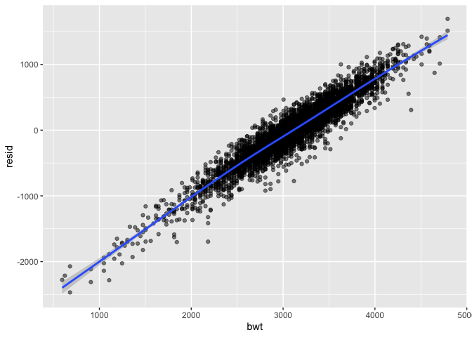
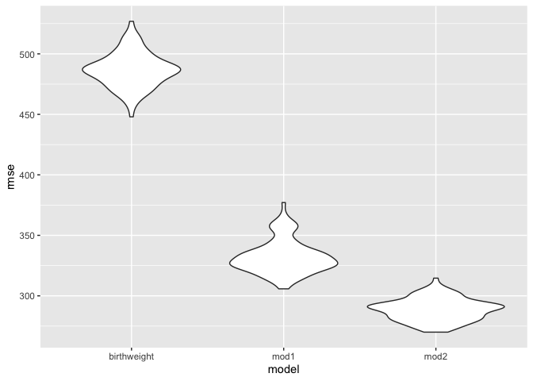
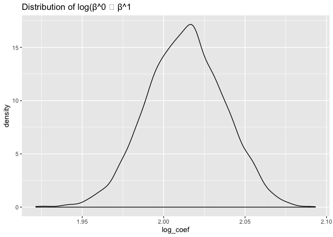
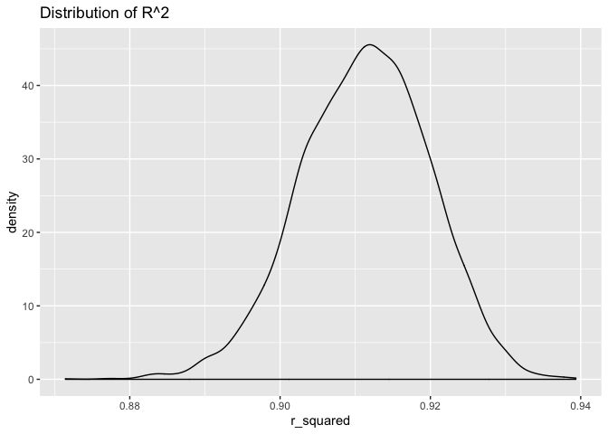

p8105 homework 6
================
Xintao Ding
11/25/2019

## Problem 1

``` r
birthweight <- read_csv("./data/birthweight.csv") %>%  #load data
  mutate(babysex = as.factor(babysex), # convert numeric to factor
         frace = as.factor(frace),
         malform = as.factor(malform),
         mrace = as.factor(mrace),
         
)
```

    ## Parsed with column specification:
    ## cols(
    ##   .default = col_double()
    ## )

    ## See spec(...) for full column specifications.

``` r
colSums(is.na(birthweight))  # no missing value in the dataset
```

    ##  babysex    bhead  blength      bwt    delwt  fincome    frace  gaweeks 
    ##        0        0        0        0        0        0        0        0 
    ##  malform menarche  mheight   momage    mrace   parity  pnumlbw  pnumsga 
    ##        0        0        0        0        0        0        0        0 
    ##    ppbmi     ppwt   smoken   wtgain 
    ##        0        0        0        0

``` r
# my own model 
birthweight_fit <- lm(bwt ~ delwt + mheight + momage + delwt * mheight + delwt * momage + mheight * momage + delwt * momage * mheight, data = birthweight)
#birthweight_fit <- lm(bwt ~ fincome + frace + mrace + smoken, data = birthweight)

birthweight_fit %>% 
  broom::glance()
```

    ## # A tibble: 1 x 11
    ##   r.squared adj.r.squared sigma statistic   p.value    df  logLik    AIC
    ##       <dbl>         <dbl> <dbl>     <dbl>     <dbl> <int>   <dbl>  <dbl>
    ## 1     0.106         0.104  485.      73.1 1.99e-100     8 -33006. 66030.
    ## # … with 3 more variables: BIC <dbl>, deviance <dbl>, df.residual <int>

``` r
birthweight_fit %>% 
  broom::tidy()
```

    ## # A tibble: 8 x 5
    ##   term                   estimate std.error statistic p.value
    ##   <chr>                     <dbl>     <dbl>     <dbl>   <dbl>
    ## 1 (Intercept)          -4968.     5390.        -0.922  0.357 
    ## 2 delwt                   65.3      37.0        1.76   0.0779
    ## 3 mheight                 92.1      85.0        1.08   0.279 
    ## 4 momage                 243.      258.         0.943  0.346 
    ## 5 delwt:mheight           -0.817     0.580     -1.41   0.159 
    ## 6 delwt:momage            -2.45      1.77      -1.39   0.165 
    ## 7 mheight:momage          -2.75      4.06      -0.678  0.498 
    ## 8 delwt:mheight:momage     0.0327    0.0276     1.18   0.236

``` r
birthweight %>% 
  add_predictions(birthweight_fit) %>% 
  add_residuals(birthweight_fit) %>% 
  ggplot(aes(x = bwt, y = resid)) +
  geom_point(alpha = 0.5) +
  geom_smooth()
```

    ## `geom_smooth()` using method = 'gam' and formula 'y ~ s(x, bs = "cs")'

<!-- -->

``` r
  labs ( x = "predicted birthweight", 
         y = "residuals")
```

    ## $x
    ## [1] "predicted birthweight"
    ## 
    ## $y
    ## [1] "residuals"
    ## 
    ## attr(,"class")
    ## [1] "labels"

I wanted to look at main effectsof and interactions between mother’s
delivery weight altogether on baby’s birthweight, mother’s height and
mother’s age at delivery on baby’s weight.

``` r
# 2 other models
mod_1 <- lm(bwt ~ blength + gaweeks, data = birthweight)
mod_2 <- lm(bwt ~ bhead + blength + babysex + bhead*blength + bhead* babysex + blength*babysex + bhead * blength * babysex, data = birthweight)

# compare three models with cross-validation

cv_df <- crossv_mc(birthweight, 100)
cv_df <- cv_df %>% 
  mutate(
    birthweight_fit = map(train, ~lm(bwt ~ delwt + mheight + momage + delwt * mheight + delwt * momage + mheight * momage + delwt * momage * mheight, data = .x)),
    mod_1 = map(train, ~lm(bwt ~ blength + gaweeks, data = .x)),
    mod_2 = map(train, ~lm(bwt ~ bhead + blength + babysex + bhead*blength + bhead* babysex + blength*babysex + bhead * blength * babysex, data = .x))) %>% 
  mutate(rmse_birthweight = map2_dbl(birthweight_fit, test,  ~rmse(model = .x, data = .y)),
         rmse_mod1 = map2_dbl(mod_1, test, ~rmse(model = .x, data = .y)),
         rmse_mod2 = map2_dbl(mod_2, test, ~rmse(model = .x, data = .y)))
  

cv_df %>% 
  select(starts_with("rmse")) %>% 
  pivot_longer(
    everything(),
    names_to = "model", 
    values_to = "rmse",
    names_prefix = "rmse_") %>% 
  mutate(model = fct_inorder(model)) %>% 
  ggplot(aes(x = model, y = rmse)) + geom_violin()
```

<!-- -->
From the comparison we could see that my model has the highest
prediction model, while mod2 that looks at bhead, blenght, babysex and
their interactions has the lowest the prediction error. My model could
take better advantage of the data and perhaps use stepwise to see what
predictors matter the most to the predictions.

## Problem 2

``` r
# load data
weather_df = 
  rnoaa::meteo_pull_monitors(
    c("USW00094728"),
    var = c("PRCP", "TMIN", "TMAX"), 
    date_min = "2017-01-01",
    date_max = "2017-12-31") %>%
  mutate(
    name = recode(id, USW00094728 = "CentralPark_NY"),
    tmin = tmin / 10,
    tmax = tmax / 10) %>%
  select(name, id, everything())
```

    ## Registered S3 method overwritten by 'crul':
    ##   method                 from
    ##   as.character.form_file httr

    ## Registered S3 method overwritten by 'hoardr':
    ##   method           from
    ##   print.cache_info httr

    ## file path:          /Users/xintaoding/Library/Caches/rnoaa/ghcnd/USW00094728.dly

    ## file last updated:  2019-09-26 10:25:09

    ## file min/max dates: 1869-01-01 / 2019-09-30

``` r
# Bootstrapping

weather_df %>% 
  modelr::bootstrap(n = 5000) %>% 
  mutate(models = map(strap, ~ lm(tmax ~ tmin, data = .x)),
         results = map(models, broom::tidy)) %>% 
  select(-strap, -models) %>% 
  unnest(results) %>% 
  group_by(.id) %>% 
  summarize(log_coef = sum(log(estimate))) %>% 
  ggplot(aes(x = log_coef)) + geom_density() +
  labs(title = "Distribution of log(β^0 ∗ β^1")
```

<!-- -->

``` r
weather_df %>% 
  modelr::bootstrap(n = 5000) %>% 
  mutate(models = map(strap, ~ lm(tmax ~ tmin, data = .x)),
         results = map(models, broom::glance)) %>% 
  select(-strap, -models) %>% 
  unnest(results) %>% 
  group_by(.id) %>% 
  summarize(r_squared = unique(r.squared)) %>% 
  ggplot(aes(x = r_squared)) + geom_density() +
  labs(title = "Distribution of R^2")
```

<!-- -->

Both the distribution of r squared and log(β^0 ∗ β^1) sligntly
left-skewed, with distribution of log(β^0 ∗ β^1) being more normally
distributed
